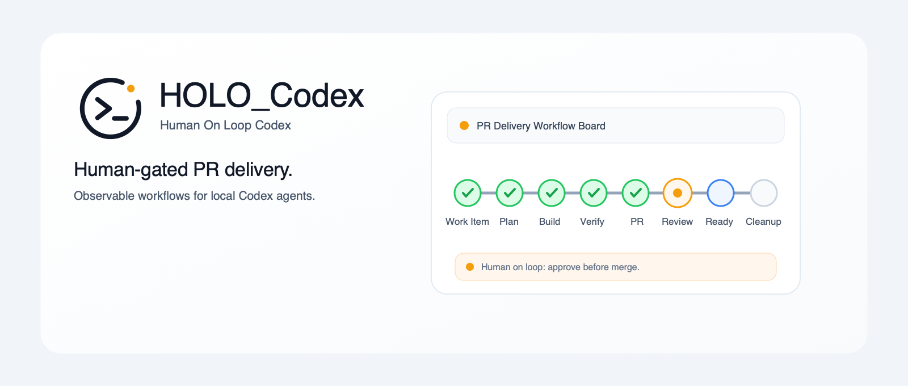

# HOLO-Codex

[中文文档](./README.zh-CN.md)



HOLO-Codex, short for **Human On Loop Codex**, turns long-running Codex workflows into observable, recoverable, human-on-loop systems. The operator sets goals and boundaries, observes progress, and steps in only when a real gate needs attention.

The supervisor owns durable workflow state, evidence, gates, worker orchestration, Codex hooks, the MCP control plane, and the local dashboard. Workers perform scoped tasks and return structured output.

## What It Provides

- A Codex plugin under `plugins/autonomous-pr-loop/`.
- The `agent-loop` CLI for local loop state, hooks, dashboard, workflow evidence, and rollback-safe local install.
- Local SQLite state under `.agent-loop/`.
- A local dashboard for Mission Control, workflow board, observability, gates, review/CI state, workers, artifacts, recovery, notifications, policy config, and theme modes.
- stdio MCP control plane.
- Codex hooks for policy checks and observability.
- TypeScript + Vitest test suite.
- Bilingual display support for `zh-CN`, `en-US`, and `system` locale selection.
- Workflow profiles, role profiles, `generic-loop`, and the first bundled workflow: `pr-loop`.

This is not a hosted service. It does not run GitHub webhooks or cloud workers.

## Compatibility Names

HOLO-Codex is the public product name. Some stable runtime identifiers intentionally keep their legacy names for compatibility:

- CLI command: `agent-loop`
- Runtime state directory: `.agent-loop/`
- Plugin id and MCP server id: `autonomous-pr-loop`
- Source directory: `plugins/autonomous-pr-loop/`
- npm package name: `holo-codex`
- Local marketplace entry name: `codex-auto-pr-loop`

Do not treat those names as a second product. They are compatibility identifiers.

## First Workflow: PR Delivery

PR delivery is the first complete workflow shipped with HOLO-Codex. It is the strongest sample of the loop model, not the product boundary.

Typical flow:

```text
sync main
bind work item
plan
build
verify
open PR
run review / CI
fix findings
check merge readiness
merge
cleanup
```

The dashboard and MCP tools read persisted loop state. They do not rely on chat history.

The same control-plane model can support other long-running Codex workflows such as release preparation, repo hygiene, security review, docs publishing, migrations, evaluations, and customer-issue triage.

## Install

Canonical public source:

```text
https://github.com/tizerluo/HOLO-Codex
```

Requirements:

- Node.js `>=22.5`
- `git`
- GitHub CLI `gh`
- Codex CLI / plugin support
- `pnpm` when installing from source or using rollback-snapshot local install
- Optional but recommended: GitNexus via `npx gitnexus`

Install from npm:

```bash
npm install --global holo-codex
# Replace /path/to/repo with the repository you want HOLO-Codex to supervise.
agent-loop --repo /path/to/repo init
agent-loop install-hooks --repo /path/to/repo
agent-loop --repo /path/to/repo doctor
```

The npm package installs the `agent-loop` CLI. `agent-loop install-hooks` installs or refreshes the hook router and target binding without reinstalling the global CLI. To remove an npm install, run `agent-loop hooks unbind --repo /path/to/repo`, remove HOLO-Codex router entries from `~/.codex/hooks.json` only when no target repositories still use them, and then run `npm uninstall --global holo-codex`.

Install from source when developing HOLO-Codex or when you want to inspect the source checkout directly:

```bash
git clone https://github.com/tizerluo/HOLO-Codex.git
cd HOLO-Codex
pnpm install
pnpm build:hooks
# Replace /path/to/repo with the repository you want HOLO-Codex to supervise.
pnpm agent-loop local install --repo /path/to/repo
agent-loop --repo /path/to/repo status
```

`pnpm agent-loop ...` is the source checkout command. `agent-loop ...` is the global convenience command for day-to-day use from any directory after npm or local source install. Use `agent-loop local snapshots prune --keep 10` to preview old snapshot cleanup, and add `--apply` only when you want to delete valid old snapshots.

For a complete local install, upgrade, reinstall, uninstall, and smoke-test checklist, see [Local Release Readiness](./docs/local-release-readiness.md).

Add HOLO-Codex to the local Codex plugin marketplace. For npm installs:

```bash
codex plugin marketplace add "$(npm root -g)/holo-codex"
```

For source installs:

```bash
codex plugin marketplace add /path/to/HOLO-Codex
```

Then enable the `autonomous-pr-loop` plugin in Codex. Plugin enablement and global CLI installation are separate steps.

## Initialize State

Run from the target repository root:

```bash
agent-loop --repo /path/to/repo init
agent-loop --repo /path/to/repo doctor
agent-loop --repo /path/to/repo status
```

Install Codex hooks:

```bash
agent-loop install-hooks --repo /path/to/repo
```

This installs one stable hook router into `~/.codex/hooks.json`, preserves existing user hooks, and records the target repository binding under `~/.codex/agent-loop/hook-bindings.json`.

Multi-repo note: multiple repositories can share the same `CODEX_HOME`; hook events are routed by Codex cwd/worktree/session context before any repo state is written or policy is applied. A separate `CODEX_HOME` remains useful for high-isolation sandbox testing.

Runtime files are written to `.agent-loop/` and must not be committed.

## Dashboard

```bash
agent-loop --repo /path/to/repo dashboard
```

The command prints a loopback URL on stdout and a fallback session token on stderr:

```text
dashboard started
url: http://127.0.0.1:<port>/
targetRepoRoot: /path/to/repo
```

Dashboard mutations require the local session token and go through the shared controller. The UI does not write SQLite directly. Loopback dashboard sessions unlock through a same-origin session bootstrap; the stderr token is only a fallback for static UI or recovery. Do not copy it into docs, logs, PR bodies, commits, artifacts, or screenshots.

Dashboard-visible delivery work is produced by persisted `agent-loop` actions and workflow evidence. Direct terminal edits or commander decisions are not automatically visible unless they are recorded through agent-loop events, artifacts, or PR comments. For the current self-maintenance flow, see [Self-bootstrap workflow](./docs/self-bootstrap.md). For an end-to-end audit template, see [Agent-loop-first Delivery Audit Checklist](./docs/checklists/agent-loop-first-delivery-audit.md).

## Common CLI

```bash
agent-loop --repo /path/to/repo status
agent-loop --repo /path/to/repo init --dry-run
agent-loop --repo /path/to/repo doctor
agent-loop --repo /path/to/repo run --dry-run
agent-loop --repo /path/to/repo run --until=gate
agent-loop --repo /path/to/repo step
agent-loop --repo /path/to/repo resume
agent-loop --repo /path/to/repo stop
agent-loop --repo /path/to/repo timeline --limit 20
agent-loop --repo /path/to/repo workers --events
agent-loop --repo /path/to/repo observe
agent-loop --repo /path/to/repo audit-export --run RUN_ID --format markdown
agent-loop --repo /path/to/repo recover
agent-loop --repo /path/to/repo approve-gate <gate-id> --note "reason"
agent-loop --repo /path/to/repo dashboard
```

Human-readable CLI output supports `--locale zh-CN|en-US|system`. JSON output remains structured and stable.

## Workflow Profiles And Themes

The default workflow remains `pr-loop` with `default_pr_loop` and `default_pr_roles`. Policy Config can also select `generic-loop` with built-in profiles for research reports, document preparation, repo hygiene, weekly review, and data extraction workflows. For a concrete non-PR workflow, see the [generic-loop repo hygiene example](./docs/examples/generic-loop-repo-hygiene.md).

Dashboard theme is a local browser preference. It supports `light`, `dark`, and `system`, and does not write to repo config or SQLite.

## Safety Boundaries

- Workers may edit files but cannot commit, push, create PRs, mark PRs ready, or merge.
- The supervisor owns Git and GitHub lifecycle actions.
- Destructive Git/GitHub commands are blocked by command policy and hooks.
- Merge readiness depends on config, review/CI evidence, open review comments, scope guard, and policy decisions.
- Never store secrets in code, docs, logs, artifacts, commits, or PR bodies.
- Hooks cover the Codex tool loop, not manual commands run in an external terminal.

## Development

```bash
pnpm test
pnpm lint
```

More docs:

- [Install](./docs/install.md)
- [Local Release Readiness](./docs/local-release-readiness.md)
- [Source Release Checklist](./docs/release-checklist.md)
- [Self-bootstrap workflow](./docs/self-bootstrap.md)
- [Agent-loop-first Delivery Audit Checklist](./docs/checklists/agent-loop-first-delivery-audit.md)
- [Generic-loop repo hygiene example](./docs/examples/generic-loop-repo-hygiene.md)
- [Trust and Safety](./docs/trust-and-safety.md)
- [Contributing](./CONTRIBUTING.md)
- [Security](./SECURITY.md)
