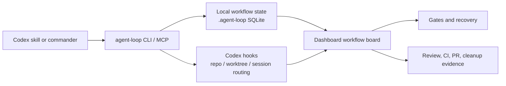

# HOLO-Codex

[中文文档](./README.zh-CN.md)


[](https://www.npmjs.com/package/holo-codex)
[](https://www.npmjs.com/package/holo-codex)
[](https://github.com/tizerluo/HOLO-Codex/releases)
[](https://github.com/tizerluo/HOLO-Codex/actions/workflows/ci.yml)
[](./LICENSE)


HOLO-Codex, short for **Human On Loop Codex**, turns long-running Codex workflows into observable, recoverable systems that you can supervise without living inside chat history.

Codex can plan, edit, test, review, and hand work across agents. HOLO-Codex gives that work a local control plane: workflow state, evidence, gates, hooks, review status, recovery actions, and a dashboard you can open while the work is running.

## Quickstart

Install the package and attach HOLO-Codex to a target repository:

```bash
npm install --global holo-codex
agent-loop --repo /path/to/repo init
agent-loop install-hooks --repo /path/to/repo
agent-loop --repo /path/to/repo dashboard
```

Open the printed loopback URL. The dashboard unlocks locally without putting a token in the URL.

Plugin enablement is separate from the CLI install:

```bash
codex plugin marketplace add "$(npm root -g)/holo-codex"
```

Then enable the `autonomous-pr-loop` plugin in Codex. The CLI is called `agent-loop` for compatibility.

## Why HOLO-Codex?

| Problem | What HOLO-Codex adds |
| --- | --- |
| Long Codex tasks disappear into a thread. | A workflow board shows the current stage, state source, evidence, and next action. |
| Manual decisions, review reports, and CI signals live in different places. | Evidence is recorded as append-only workflow events and surfaced in the dashboard. |
| Recovery gets hard after a pause, gate, failed worker, or context switch. | Gates, recovery actions, timeline, artifacts, and hook diagnostics stay tied to the run. |

## What It Gives You

- Workflow Board for long Codex workflows, including stage status, evidence counts, and current-stage details.
- Evidence Trail for plans, implementation notes, tests, reviews, PR actions, CI checks, merge readiness, and cleanup.
- Gates and Recovery for policy blocks, human approval, stale runs, and historical gate re-evaluation.
- Hook-based Observability that routes Codex hook events by repo, worktree, and session context.
- Local Dashboard for Mission Control, observability, gates, review/CI state, workers, artifacts, notifications, policy config, and theme modes.
- CLI and stdio MCP control plane for scripts, skills, and Codex plugin actions.
- Review and CI visibility through structured review evidence, severity summaries, PR comment links, and merge readiness checks.

HOLO-Codex is local-first. It is not a hosted service, and it does not run cloud workers or GitHub webhooks for you.

## How It Fits Together



The dashboard and MCP tools read persisted loop state. They do not depend on the chat transcript being intact.

## First Workflow: PR Delivery

PR delivery is the first bundled workflow. It is the strongest sample today, not the product boundary.

```text
Work Item -> Plan -> Build -> Verify -> PR -> Review -> Merge Readiness -> Cleanup
```

The bundled PR workflow can bind a GitHub issue, track implementation evidence, collect tester and reviewer reports, show PR and CI readiness, and keep cleanup visible after merge.

The same control-plane model can support other long-running Codex workflows:

- release preparation
- repo hygiene
- security review
- docs publishing
- migrations
- evaluations
- customer issue triage

## Compatibility Names

HOLO-Codex is the public product name. Some runtime identifiers keep older names so existing installs and local state do not break:

| Public concept | Stable identifier |
| --- | --- |
| CLI command | `agent-loop` |
| Runtime state directory | `.agent-loop/` |
| Plugin id and MCP server id | `autonomous-pr-loop` |
| Source directory | `plugins/autonomous-pr-loop/` |
| npm package | `holo-codex` |
| Local marketplace entry | `codex-auto-pr-loop` |

These are compatibility identifiers, not separate products.

## Install Details

Canonical public source:

```text
https://github.com/tizerluo/HOLO-Codex
```

Requirements:

- Node.js `>=22.5`
- `git`
- GitHub CLI `gh`
- Codex CLI / plugin support
- `pnpm` when installing from source or using rollback-snapshot local install
- Optional: GitNexus via `npx gitnexus`

Install from npm:

```bash
npm install --global holo-codex
agent-loop --repo /path/to/repo init
agent-loop install-hooks --repo /path/to/repo
agent-loop --repo /path/to/repo doctor
```

The npm package installs the `agent-loop` CLI. `agent-loop install-hooks` installs or refreshes the hook router and target binding without reinstalling the global CLI.

To remove an npm install:

```bash
agent-loop hooks unbind --repo /path/to/repo
npm uninstall --global holo-codex
```

Remove HOLO-Codex router entries from `~/.codex/hooks.json` only when no target repositories still use them.

Install from source when developing HOLO-Codex or when you want to inspect the checkout:

```bash
git clone https://github.com/tizerluo/HOLO-Codex.git
cd HOLO-Codex
pnpm install
pnpm build:hooks
pnpm agent-loop local install --repo /path/to/repo
agent-loop --repo /path/to/repo status
```

`pnpm agent-loop ...` runs from the source checkout. `agent-loop ...` is the global command after npm or local source install.

For the full install, upgrade, reinstall, uninstall, rollback, and smoke-test checklist, see [Local Release Readiness](./docs/local-release-readiness.md).

## Initialize A Repo

Run from the target repository root or pass `--repo`:

```bash
agent-loop --repo /path/to/repo init
agent-loop --repo /path/to/repo doctor
agent-loop install-hooks --repo /path/to/repo
```

Hook installation writes one router into `~/.codex/hooks.json`, preserves existing hooks, and records target repository bindings under `~/.codex/agent-loop/hook-bindings.json`.

Multiple repositories can share the same `CODEX_HOME`. Hook events are routed by Codex cwd, worktree, and session context before any repository state is written or policy is applied. A separate `CODEX_HOME` is still useful for high-isolation sandbox testing.

Runtime files are written to `.agent-loop/` and must not be committed.

## Dashboard

```bash
agent-loop --repo /path/to/repo dashboard
```

The command prints a loopback URL:

```text
dashboard started
url: http://127.0.0.1:<port>/
targetRepoRoot: /path/to/repo
```

Dashboard mutations require the local session token and go through the shared controller. The UI does not write SQLite directly. Loopback dashboard sessions unlock through a same-origin bootstrap; the stderr token is only a fallback for static UI or recovery. Do not copy it into docs, logs, PR bodies, commits, artifacts, or screenshots.

Dashboard-visible delivery work comes from persisted `agent-loop` actions and workflow evidence. Direct terminal edits or commander decisions become visible only when they are recorded as agent-loop events, artifacts, or PR comments.

## Common CLI

```bash
agent-loop --repo /path/to/repo status
agent-loop --repo /path/to/repo init --dry-run
agent-loop --repo /path/to/repo doctor
agent-loop --repo /path/to/repo run --dry-run
agent-loop --repo /path/to/repo run --until=gate
agent-loop --repo /path/to/repo step
agent-loop --repo /path/to/repo resume
agent-loop --repo /path/to/repo stop
agent-loop --repo /path/to/repo timeline --limit 20
agent-loop --repo /path/to/repo workers --events
agent-loop --repo /path/to/repo observe
agent-loop --repo /path/to/repo audit-export --run RUN_ID --format markdown
agent-loop --repo /path/to/repo recover
agent-loop --repo /path/to/repo approve-gate <gate-id> --note "reason"
agent-loop --repo /path/to/repo dashboard
```

Human-readable CLI output supports `--locale zh-CN|en-US|system`. JSON output remains structured and stable.

## Workflow Profiles And Themes

The default workflow is `pr-loop` with `default_pr_loop` and `default_pr_roles`. Policy Config can also select `generic-loop` with built-in profiles for research reports, document preparation, repo hygiene, weekly review, and data extraction workflows. For a concrete non-PR workflow, see the [generic-loop repo hygiene example](./docs/examples/generic-loop-repo-hygiene.md).

Dashboard theme is a local browser preference. It supports `light`, `dark`, and `system`, and does not write to repo config or SQLite.

## Safety Boundaries

- Workers may edit files but cannot commit, push, create PRs, mark PRs ready, or merge.
- The supervisor owns Git and GitHub lifecycle actions.
- Destructive Git/GitHub commands are blocked by command policy and hooks.
- Merge readiness depends on config, review/CI evidence, open review comments, scope guard, and policy decisions.
- HOLO-Codex must not store secrets, raw prompts, raw transcripts, dashboard tokens, or raw hook payloads in docs, logs, artifacts, commits, or PR bodies.
- Hooks cover the Codex tool loop, not manual commands run in an external terminal.

See [Trust and Safety](./docs/trust-and-safety.md) and [Security](./SECURITY.md).

## FAQ

### Is HOLO-Codex hosted?

No. HOLO-Codex runs locally. The dashboard, SQLite state, hooks, and CLI live on your machine.

### Does it replace Codex?

No. Codex still does the work. HOLO-Codex gives long Codex workflows state, evidence, gates, recovery, and a dashboard.

### Why is the CLI still called `agent-loop`?

`agent-loop` is the stable runtime command. Keeping it avoids breaking existing installs, scripts, hooks, and local state.

### Why is the plugin id still `autonomous-pr-loop`?

That id is part of the existing plugin and MCP wiring. HOLO-Codex is the public product name; `autonomous-pr-loop` is a compatibility identifier.

### Does it auto-merge PRs?

No. HOLO-Codex can track merge readiness and evidence, but the supervisor controls Git and GitHub lifecycle actions.

### Does it require GitHub?

The bundled PR delivery workflow expects GitHub and `gh`. The underlying loop model can support non-PR workflows through `generic-loop`.

### Where is state stored?

Repository runtime state lives under `.agent-loop/`. Hook routing bindings live under `~/.codex/agent-loop/`. Runtime files should not be committed.

## Development

```bash
pnpm test
pnpm lint
```

More docs:

- [Install](./docs/install.md)
- [Local Release Readiness](./docs/local-release-readiness.md)
- [Source Release Checklist](./docs/release-checklist.md)
- [Self-bootstrap workflow](./docs/self-bootstrap.md)
- [Agent-loop-first Delivery Audit Checklist](./docs/checklists/agent-loop-first-delivery-audit.md)
- [Generic-loop repo hygiene example](./docs/examples/generic-loop-repo-hygiene.md)
- [Trust and Safety](./docs/trust-and-safety.md)
- [Contributing](./CONTRIBUTING.md)
- [Security](./SECURITY.md)
