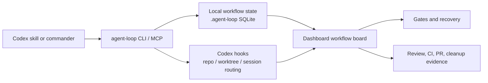

# HOLO-Codex

[English README](./README.md)


[](https://www.npmjs.com/package/holo-codex)
[](https://www.npmjs.com/package/holo-codex)
[](https://github.com/tizerluo/HOLO-Codex/releases)
[](https://github.com/tizerluo/HOLO-Codex/actions/workflows/ci.yml)
[](./LICENSE)


HOLO-Codex 是 **Human On Loop Codex** 的缩写。它把长流程 Codex workflow 变成可观察、可恢复、可人工接管的系统，让你不用一直守在聊天记录里猜它做到了哪一步。

Codex 负责计划、改代码、测试、review 和调用子代理。HOLO-Codex 负责把这些工作落到本地 control plane 上：workflow 状态、evidence、gates、hooks、review 状态、恢复动作，以及一个可以边跑边看的 dashboard。

## 快速开始

安装 npm package，并把 HOLO-Codex 接到一个目标仓库：

```bash
npm install --global holo-codex
agent-loop --repo /path/to/repo init
agent-loop install-hooks --repo /path/to/repo
agent-loop --repo /path/to/repo dashboard
```

打开命令打印出来的本地 URL。Dashboard 会在本机自动解锁，不会把 token 放进 URL。

Codex plugin 启用和 CLI 安装是两件事：

```bash
codex plugin marketplace add "$(npm root -g)/holo-codex"
```

然后在 Codex 里启用 `autonomous-pr-loop` 插件。CLI 继续叫 `agent-loop`，这是兼容已有安装和本地状态的名字。

## 为什么需要 HOLO-Codex

| 问题 | HOLO-Codex 补上的东西 |
| --- | --- |
| 长流程 Codex 任务容易消失在一个聊天线程里。 | Workflow board 会显示当前阶段、状态来源、证据和下一步。 |
| 人工决策、review report、CI 信号分散在不同地方。 | Evidence 会作为 append-only workflow event 记录下来，并显示在 dashboard。 |
| 一旦暂停、遇到 gate、worker 失败或切上下文，恢复成本很高。 | Gate、recovery、timeline、artifact 和 hook 诊断都会绑定到同一个 run。 |

## 它提供什么

- Workflow Board：展示长流程 Codex workflow 的阶段状态、证据数量和当前阶段详情。
- Evidence Trail：记录计划、实现、测试、review、PR、CI、merge readiness 和 cleanup。
- Gates and Recovery：处理 policy block、人工批准、stale run 和历史 gate re-evaluate。
- Hook-based Observability：按 repo、worktree、session context 路由 Codex hook events。
- Local Dashboard：包含 Mission Control、Observability Console、Gate、Review/CI、Worker、Artifact、Notifications、Recovery、Policy Config 和主题模式。
- CLI 和 stdio MCP control plane：供脚本、skills 和 Codex plugin 调用。
- Review and CI visibility：通过结构化 review evidence、severity summary、PR comment link 和 merge readiness 追踪交付状态。

HOLO-Codex 是 local-first 工具。它不是托管服务，也不会替你运行云端 worker 或 GitHub webhook daemon。

## 它如何工作



Dashboard 和 MCP tools 读取持久化 loop 状态，不依赖聊天记录还在不在。

## 第一个工作流：PR 交付

PR 交付是 HOLO-Codex 随附的第一个完整 workflow，也是目前最完整的样板，但它不是产品边界。

```text
Work Item -> Plan -> Build -> Verify -> PR -> Review -> Merge Readiness -> Cleanup
```

内置 PR workflow 可以绑定 GitHub issue、追踪实现证据、收集 tester 和 reviewer report、显示 PR/CI readiness，并在 merge 后继续保留 cleanup 状态。

同一套 control plane 以后也可以承载其他长流程 Codex workflow：

- release 准备
- repo hygiene
- security review
- docs publishing
- migration
- evaluation
- customer issue triage

## 兼容名称

HOLO-Codex 是公开产品名。一些运行时标识会继续保留旧名称，避免破坏已有安装、脚本、hooks 和本地状态：

| 公开概念 | 稳定标识 |
| --- | --- |
| CLI 命令 | `agent-loop` |
| 运行态目录 | `.agent-loop/` |
| Plugin id 和 MCP server id | `autonomous-pr-loop` |
| 源码目录 | `plugins/autonomous-pr-loop/` |
| npm package | `holo-codex` |
| 本地 marketplace 条目 | `codex-auto-pr-loop` |

这些是兼容标识，不是第二个产品名。

## 安装细节

公开源码入口：

```text
https://github.com/tizerluo/HOLO-Codex
```

依赖：

- Node.js `>=22.5`
- `git`
- GitHub CLI `gh`
- Codex CLI / plugin support
- 从源码安装或使用 snapshot/rollback local install 时需要 `pnpm`
- 可选：GitNexus，使用 `npx gitnexus`

从 npm 安装：

```bash
npm install --global holo-codex
agent-loop --repo /path/to/repo init
agent-loop install-hooks --repo /path/to/repo
agent-loop --repo /path/to/repo doctor
```

npm package 会安装 `agent-loop` CLI。`agent-loop install-hooks` 会安装或刷新 hook router 和目标仓库绑定，不会重新安装全局 CLI。

移除 npm 安装：

```bash
agent-loop hooks unbind --repo /path/to/repo
npm uninstall --global holo-codex
```

只有确认没有任何目标仓库还在使用 HOLO-Codex router 后，才从 `~/.codex/hooks.json` 移除 HOLO-Codex router entries。

开发 HOLO-Codex 或需要直接检查源码 checkout 时，从源码安装：

```bash
git clone https://github.com/tizerluo/HOLO-Codex.git
cd HOLO-Codex
pnpm install
pnpm build:hooks
pnpm agent-loop local install --repo /path/to/repo
agent-loop --repo /path/to/repo status
```

`pnpm agent-loop ...` 是源码 checkout 内的命令。`agent-loop ...` 是 npm 或本地源码安装后从任意目录使用的全局命令。

完整的安装、升级、重装、卸载、rollback 和 smoke test 清单见：[Local Release Readiness](./docs/local-release-readiness.md)。

## 初始化一个仓库

在目标仓库根目录执行，或显式传 `--repo`：

```bash
agent-loop --repo /path/to/repo init
agent-loop --repo /path/to/repo doctor
agent-loop install-hooks --repo /path/to/repo
```

Hook 安装会向 `~/.codex/hooks.json` 写入一组 router，保留已有 hooks，并在 `~/.codex/agent-loop/hook-bindings.json` 记录目标仓库绑定。

多个仓库可以共用同一个 `CODEX_HOME`。Hook event 会先按 Codex cwd、worktree 和 session context 路由，再写入仓库状态或执行 policy。独立 `CODEX_HOME` 仍适合高隔离 sandbox 测试。

运行态文件写入 `.agent-loop/`，不要提交。

## Dashboard

```bash
agent-loop --repo /path/to/repo dashboard
```

命令会打印一个本地 URL：

```text
dashboard 已启动
url: http://127.0.0.1:<port>/
targetRepoRoot: /path/to/repo
```

Dashboard mutation 必须带本地 session token，并统一走 controller。UI 不直接写 SQLite。本地 loopback dashboard 会用同源 bootstrap 自动解锁。stderr token 只作为静态 UI 或恢复场景的 fallback，不要把它复制到 docs、日志、PR body、commit、artifact 或截图里。

Dashboard 能看到的交付工作来自持久化的 `agent-loop` 动作和 workflow evidence。直接在终端改文件或 commander 决策不会自动出现在 dashboard，除非它们被记录成 agent-loop event、artifact 或 PR comment。

## 常用 CLI

```bash
agent-loop --repo /path/to/repo status
agent-loop --repo /path/to/repo init --dry-run
agent-loop --repo /path/to/repo doctor
agent-loop --repo /path/to/repo run --dry-run
agent-loop --repo /path/to/repo run --until=gate
agent-loop --repo /path/to/repo step
agent-loop --repo /path/to/repo resume
agent-loop --repo /path/to/repo stop
agent-loop --repo /path/to/repo timeline --limit 20
agent-loop --repo /path/to/repo workers --events
agent-loop --repo /path/to/repo observe
agent-loop --repo /path/to/repo audit-export --run RUN_ID --format markdown
agent-loop --repo /path/to/repo recover
agent-loop --repo /path/to/repo approve-gate <gate-id> --note "reason"
agent-loop --repo /path/to/repo dashboard
```

人类可读 CLI 输出支持 `--locale zh-CN|en-US|system`。JSON 输出保持结构化和稳定。

## Workflow Profiles 和主题

默认 workflow 是 `pr-loop`，使用 `default_pr_loop` 和 `default_pr_roles`。Policy Config 也可以选择 `generic-loop`，并使用内置的调研报告、文档准备、仓库卫生审计、周报、数据抽取 workflow profiles。具体非 PR 工作流可参考：[generic-loop 仓库卫生审计示例](./docs/examples/generic-loop-repo-hygiene.md)。

Dashboard 主题是浏览器本地显示偏好，支持 `light`、`dark` 和 `system`，不会写入 repo config 或 SQLite。

## 安全边界

- Worker 可以改文件，但不能 commit、push、create PR、mark PR ready 或 merge。
- Supervisor 负责 Git 和 GitHub 生命周期。
- 破坏性 Git/GitHub 命令由 command policy 和 hooks 阻止。
- Merge readiness 由 config、review/CI evidence、open review comments、scope guard 和 policy decisions 共同决定。
- HOLO-Codex 不应该把 secrets、raw prompts、raw transcripts、dashboard tokens 或 raw hook payloads 写入 docs、日志、artifacts、commit 或 PR body。
- Hooks 只覆盖 Codex tool loop，不拦截外部 Terminal 手动命令。

更多细节见：[信任与安全](./docs/trust-and-safety.md) 和 [安全政策](./SECURITY.md)。

## FAQ

### HOLO-Codex 是托管服务吗？

不是。HOLO-Codex 在本机运行。Dashboard、SQLite 状态、hooks 和 CLI 都在你的机器上。

### 它会替代 Codex 吗？

不会。Codex 还是负责做事。HOLO-Codex 给长流程 Codex 工作补上状态、证据、gate、恢复动作和 dashboard。

### 为什么 CLI 还叫 `agent-loop`？

`agent-loop` 是稳定运行时命令。保留这个名字可以避免破坏已有安装、脚本、hooks 和本地状态。

### 为什么 plugin id 还是 `autonomous-pr-loop`？

这个 id 已经接入现有 plugin 和 MCP wiring。HOLO-Codex 是公开产品名，`autonomous-pr-loop` 是兼容标识。

### 它会自动 merge PR 吗？

不会。HOLO-Codex 可以追踪 merge readiness 和 evidence，但 Git 和 GitHub 生命周期动作仍由 supervisor 控制。

### 它必须依赖 GitHub 吗？

内置 PR delivery workflow 需要 GitHub 和 `gh`。底层 loop 模型可以通过 `generic-loop` 承载非 PR workflow。

### 状态存在哪里？

仓库运行态状态在 `.agent-loop/` 下。Hook routing bindings 在 `~/.codex/agent-loop/` 下。运行态文件不要提交。

## 开发

```bash
pnpm test
pnpm lint
```

更多文档：

- [安装](./docs/install.md)
- [Local Release Readiness](./docs/local-release-readiness.md)
- [Source Release Checklist](./docs/release-checklist.md)
- [自举维护流程](./docs/self-bootstrap.md)
- [Agent-loop-first Delivery Audit Checklist](./docs/checklists/agent-loop-first-delivery-audit.md)
- [generic-loop 仓库卫生审计示例](./docs/examples/generic-loop-repo-hygiene.md)
- [信任与安全](./docs/trust-and-safety.md)
- [贡献指南](./CONTRIBUTING.md)
- [安全政策](./SECURITY.md)
